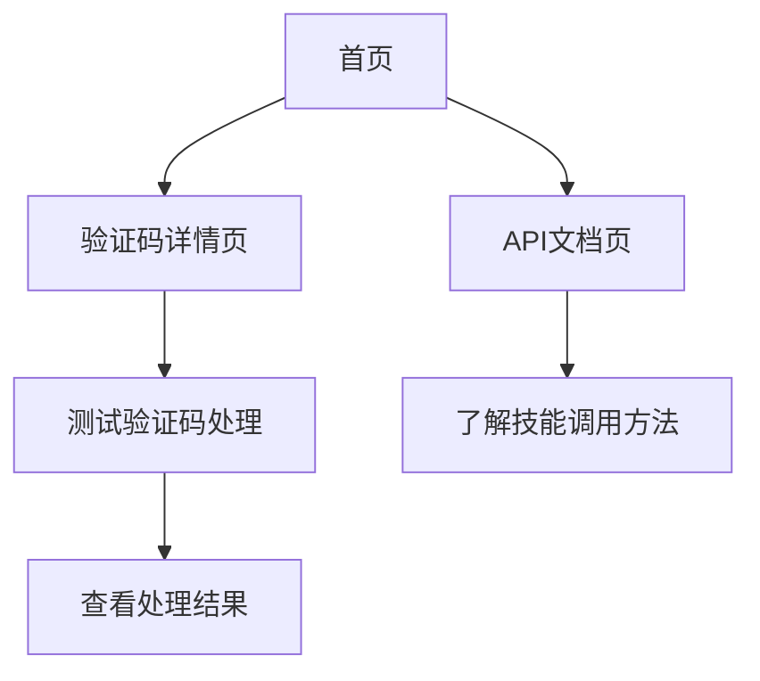

## 1. 产品概述
验证码展示前端页面，用于展示和测试各种类型的验证码，为验证码自动处理技能提供可视化界面。
- 主要目的是展示不同类型的验证码，方便用户了解验证码的多样性和特点
- 目标用户为需要开发验证码自动处理功能的开发者和测试人员

## 2. 核心功能

### 2.1 用户角色
| 角色 | 注册方式 | 核心权限 |
|------|---------------------|------------------|
| 普通用户 | 无需注册 | 浏览验证码展示、测试验证码处理功能 |

### 2.2 功能模块
1. **首页**：验证码类型展示、导航栏、功能介绍
2. **验证码详情页**：具体验证码展示、测试功能、处理结果展示
3. **API文档页**：技能调用说明、API接口文档

### 2.3 页面详情
| 页面名称 | 模块名称 | 功能描述 |
|-----------|-------------|---------------------|
| 首页 | 验证码类型展示 | 展示各种类型的验证码，包括传统图形验证码、滑动验证码、点选式验证码、行为验证码等 |
| 首页 | 导航栏 | 提供页面导航，包括首页、API文档等 |
| 首页 | 功能介绍 | 简要介绍验证码自动处理技能的功能和使用方法 |
| 验证码详情页 | 验证码展示 | 展示具体类型的验证码，支持实时生成和刷新 |
| 验证码详情页 | 测试功能 | 提供测试按钮，调用验证码处理技能进行处理 |
| 验证码详情页 | 处理结果展示 | 展示验证码处理的结果和处理时间 |
| API文档页 | 技能调用说明 | 详细说明如何调用验证码自动处理技能 |
| API文档页 | API接口文档 | 提供API接口的详细参数和返回值说明 |

## 3. 核心流程
用户访问首页，浏览各种类型的验证码，点击感兴趣的验证码类型进入详情页，在详情页中可以测试验证码处理功能，查看处理结果。同时，用户可以查看API文档，了解如何在自己的项目中集成验证码自动处理技能。

## 4. 用户界面设计
### 4.1 设计风格
- 主色调：蓝色 (#165DFF) 和灰色 (#F5F7FA)
- 辅助色：绿色 (#00B42A)、红色 (#F53F3F)、黄色 (#FF7D00)
- 按钮风格：圆角按钮，有轻微的阴影效果
- 字体：Inter，标题使用粗体，正文使用常规字体
- 布局风格：卡片式布局，顶部导航栏
- 图标风格：使用lucide-react图标库，简洁现代

### 4.2 页面设计概览
| 页面名称 | 模块名称 | UI元素 |
|-----------|-------------|-------------|
| 首页 | 验证码类型展示 | 卡片式布局，每个验证码类型一个卡片，包含名称、描述和示例图片，鼠标悬停时有轻微的放大效果 |
| 首页 | 导航栏 | 顶部固定导航栏，包含logo、导航链接和搜索框 |
| 首页 | 功能介绍 | 简洁的文字描述，配合图标展示核心功能 |
| 验证码详情页 | 验证码展示 | 居中展示验证码，周围有足够的留白，提供刷新按钮 |
| 验证码详情页 | 测试功能 | 醒目的测试按钮，点击后显示处理中状态 |
| 验证码详情页 | 处理结果展示 | 处理完成后显示结果，使用不同颜色区分成功和失败状态 |
| API文档页 | 技能调用说明 | 分步骤的文字说明，配合代码示例 |
| API文档页 | API接口文档 | 表格形式展示API参数和返回值，代码示例使用语法高亮 |

### 4.3 响应式设计
- 采用桌面优先的设计理念
- 在移动设备上自动调整布局，确保良好的用户体验
- 支持触摸操作，特别是在测试滑动验证码等交互类型的验证码时

### 4.4 交互设计
- 验证码卡片点击有轻微的反馈效果
- 测试按钮在点击后显示加载状态
- 处理结果展示时使用过渡动画
- 页面切换时使用平滑的过渡效果