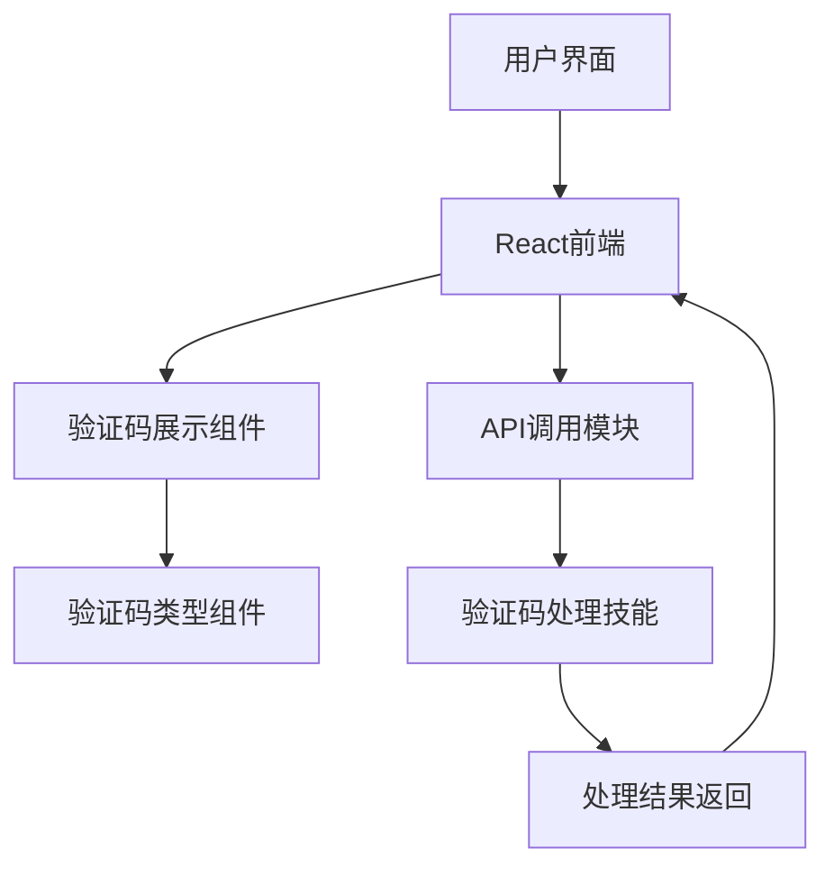

## 1. 架构设计


## 2. 技术描述
- 前端：React@18 + tailwindcss@3 + vite
- 初始化工具：vite-init
- 状态管理：zustand
- 路由：react-router-dom
- 图标库：lucide-react
- 代码高亮：react-syntax-highlighter
- 动画：CSS transitions + framer-motion

## 3. 路由定义
| 路由 | 用途 |
|-------|---------|
| / | 首页，展示各种验证码类型 |
| /captcha/:type | 验证码详情页，展示具体类型的验证码并提供测试功能 |
| /api | API文档页，提供技能调用说明和API接口文档 |

## 4. 数据模型
### 4.1 验证码类型模型
```typescript
interface CaptchaType {
  id: string;
  name: string;
  description: string;
  image: string;
  difficulty: 'easy' | 'medium' | 'hard';
  examples: string[];
}
```

### 4.2 处理结果模型
```typescript
interface ProcessResult {
  success: boolean;
  result: string;
  time: number; // 处理时间（毫秒）
  error?: string;
}
```

## 5. 组件结构
```
/src
  /components
    /layout
      Navbar.tsx
      Footer.tsx
    /captcha
      CaptchaCard.tsx
      ImageCaptcha.tsx
      SliderCaptcha.tsx
      ClickCaptcha.tsx
      BehaviorCaptcha.tsx
    /common
      Button.tsx
      Card.tsx
      Loading.tsx
  /pages
    Home.tsx
    CaptchaDetail.tsx
    ApiDoc.tsx
  /hooks
    useCaptcha.ts
  /utils
    api.ts
  /store
    captchaStore.ts
  App.tsx
  main.tsx
```

## 6. 核心功能实现
### 6.1 验证码展示
- 使用React组件展示不同类型的验证码
- 支持实时生成和刷新验证码
- 为每种验证码类型提供专门的组件

### 6.2 测试功能
- 调用验证码处理技能的API接口
- 展示处理状态和结果
- 计算处理时间

### 6.3 API文档
- 展示技能调用方法和参数
- 提供代码示例和使用说明
- 支持不同编程语言的代码示例

## 7. 性能优化
- 使用React.memo优化组件渲染
- 懒加载验证码组件
- 缓存处理结果
- 优化图片资源

## 8. 响应式设计
- 使用Tailwind CSS的响应式类
- 在不同屏幕尺寸下调整布局
- 优化移动设备上的触摸操作

## 9. 部署方案
- 构建静态文件
- 部署到静态网站托管服务
- 支持CI/CD流程